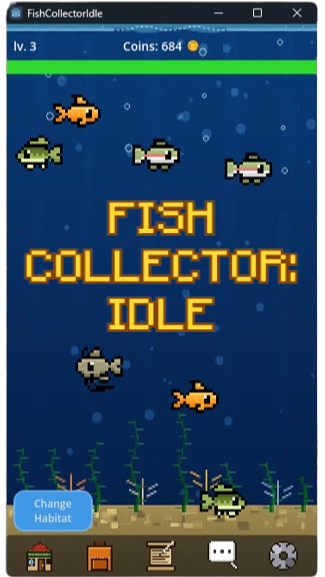

# Fish Collector: Idle

> Un videojuego 2D idle de pesca con funcionalidades multijugador en tiempo real, desarrollado con Godot 4.6 y Firebase.



---

## Descripción

**Fish Collector: Idle** es un videojuego 2D de género idle/incremental en el que los jugadores capturan peces mediante un sistema de clics, los coleccionan en un inventario, los venden para obtener monedas o los intercambian con otros usuarios a través de un mercado integrado. Un chat global y un sistema de misiones y logros completan la experiencia.

El backend se sustenta sobre **Firebase**: Firebase Auth gestiona el registro e inicio de sesión, mientras que Firestore almacena el progreso de cada jugador, los mensajes del chat, la presencia online y las ofertas del mercado. La integración con Godot se realiza mediante el plugin [godot-firebase](https://github.com/GodotNuts/GodotFirebase).

### Plataformas
- **Windows** — ejecutable x86_64
- **Android** — APK arm64-v8a (orientación vertical, modo inmersivo)

---

## Tecnologías

| Capa | Tecnología |
|---|---|
| Motor de juego | Godot 4.6 (GDScript) |
| Renderizado | GL Compatibility (OpenGL ES 3.0) |
| Autenticación | Firebase Auth |
| Base de datos | Cloud Firestore (NoSQL) |
| Integración Firebase | Plugin [godot-firebase](https://github.com/GodotNuts/GodotFirebase) |
| Resolución base | 360×640 (orientación vertical) |

---

## Estructura del proyecto

```
FishCollectorIdle/
├── Scripts/                    # Scripts GDScript: Autoloads y lógica de escenas
│   ├── FirebaseManager.gd      # Auth, guardado en nube, chat, presencia, mercado
│   ├── DataManager.gd          # Bases de datos estáticas y lógica de selección de peces
│   ├── InventoryManager.gd     # Gestión del inventario + sincronización Firestore
│   ├── UpgradeManager.gd       # Mejoras adquiridas y sus efectos sobre las mecánicas
│   ├── QuestManager.gd         # Estado de misiones, progreso y recompensas
│   ├── LevelManager.gd         # Experiencia y desbloqueos por nivel
│   ├── FishingScreen.gd        # Orquestación de la escena principal
│   ├── SkillCheck.gd           # Lógica del minijuego de pesca
│   ├── Data.gd                 # Datos de sesión compartidos entre Autoloads
│   ├── File.gd                 # Persistencia local de la partida
│   └── WindowManager.gd        # Control de ventana y orientación de pantalla
├── Scenes/                     # Escenas Godot (.tscn)
├── Assets/                     # Sprites, fondos y elementos de UI
├── Database/                   # Datos estáticos en JSON (peces, niveles, mejoras, misiones, hábitats)
├── Themes/                     # Tema visual del juego
├── addons/godot-firebase/      # Plugin de integración con Firebase
├── images/                     # Capturas de pantalla
├── index.html                  # Landing page del proyecto
├── FIRESTORE_RULES_CHAT.txt    # Reglas de seguridad de Firestore
├── export_presets.cfg          # Configuración de exportación (Windows y Android)
└── project.godot               # Configuración del proyecto Godot
```

---

## Modelo de datos (Firestore)

| Colección | Descripción |
|---|---|
| `user_saves` | Un documento por jugador (ID = Firebase UID). Almacena monedas, stamina, nivel, XP, inventario, mejoras y misiones. |
| `global_chat_messages` | Mensajes del chat global. Las reglas validan longitud (1–180 caracteres) y que el `uid` coincida con el usuario autenticado. |
| `online_presence` | Heartbeat de presencia por jugador. Solo el propio usuario puede actualizar su documento. |
| `trade_offers` | Ofertas activas y completadas del mercado. Las reglas exigen estado `active` en la creación y solo permiten marcar como `completed` a un usuario distinto al vendedor. |

---

## Reglas de seguridad de Firestore

Las reglas de seguridad protegen la integridad de los datos directamente en la base de datos:

- Los usuarios no autenticados no pueden leer ni escribir en ninguna colección.
- Cada jugador solo puede leer y modificar su propio documento en `user_saves` y `online_presence`.
- Los mensajes de chat son rechazados si superan los 180 caracteres o si el campo `uid` no coincide con el usuario autenticado.
- Las ofertas de intercambio solo pueden crearse con estado `active` por el usuario propietario, y únicamente pueden marcarse como `completed` por un usuario diferente al vendedor.

Las reglas completas están disponibles en [`FIRESTORE_RULES_CHAT.txt`](FIRESTORE_RULES_CHAT.txt).

---

## Cómo jugar

Descarga la última versión y obtén más información sobre cómo jugar desde la página de [Releases](https://github.com/joellozanobarbancho/FishCollectorIdle/releases):

- **Windows**: ejecuta `FishCollectorIdle.exe`
- **Android**: instala `FishCollectorIdle.apk` (activa la instalación desde orígenes desconocidos si es necesario)

## Compilar desde el código fuente

1. Instala [Godot 4.6](https://godotengine.org/download).
2. Clona este repositorio.
3. Abre `project.godot` en el editor de Godot.
4. Configura tu propio proyecto Firebase y actualiza las credenciales en el plugin `addons/godot-firebase/`.
5. Ejecuta el proyecto desde el editor o expórtalo usando `export_presets.cfg`.

> **Nota:** El juego requiere un proyecto Firebase con Firestore y Authentication (email/contraseña) habilitados. Las reglas de seguridad de Firestore del archivo `FIRESTORE_RULES_CHAT.txt` deben aplicarse a tu instancia de Firestore.

---

## Licencia

[CC BY-NC-ND 3.0 ES](https://creativecommons.org/licenses/by-nc-nd/3.0/es/) — Atribución, No Comercial, Sin Derivadas.

---

*Institut Puig Castellar · DAM 2025–2026 · Joel Lozano Barbancho*
